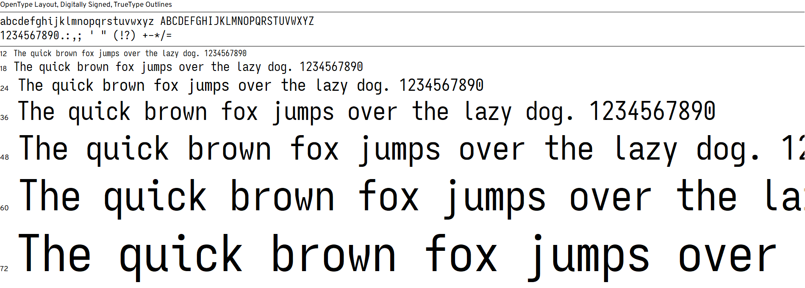

# Trent B on Gatsby!

*Trent B on Gatsby!* is a GatsbyJS implementation of my personal website that 
was developed using HTML, CSS, and JavaScript, and was hosted on 
[Centennial College's Student Web server](http://studentweb.cencol.ca/)!

[*trentb10 on GitHub Pages*](https://trentb10.github.io/studentweb-cencol-github-pages/) 
is a GitHub Pages implementation of my personal website that is used to host my
assignments for COMP213 Web Interface Design and COMP125 Client-Side Development
at Centennial College. I had planned to host all features of my personal website
on GitHub pages before I decided to use GatsbyJS instead.

This repository is used to host the website on the GatsbyJS cloud.

# Release Notes

**2021-07-03**: Version 1.0.2
 - Updated education

**2021-07-03**: Version 1.0.1
 - Minor changes made to the About Me page, the footer, and readme

**2021-06-22**: Version 1.0
 - Released on Gatsby Cloud!

# Branch Notes

As soon as Trent B on Gatsby! reaches Version 1.0 release, there will be two 
branches set up to manage the project the rest of the way:

* `main`: The main branch of the project repository that will be used to publish 
the website on the cloud
* `development`: The development branch of the project repository. All changes 
and new features will be developed and pushed to this branch before being 
released and pushed to the `main` branch.

# Feature Overview Summary

*Trent B on Gatsby!* is my personal website implemented using GatsbyJS! During 
development, my site's working title was *Trent B's Dream World!*

## Page Navigation Map

My site may be navigated using the navbar at the top. The navigable pages are:

* `Home`
* `About Me`
* `Assignments`
  * `Centennial College`
  * `University of Toronto`
* `Works`
  * `24Our Music`
  * `Amp the Sound`
  * `Dollar Gamers`
  * `Feed My Curiosity`
  * `Personal Works`

Each bullet point has its own page. `Works` and `Assignments` pages features 
collapsibles. `About Me` has a skillbox, that is also made using collapsibles.

## Fonts

The following fonts were used:

 * PT Sans
 * Monda
 * Share Tech Mono
 * Customized Iosevka

My customized Iosevka font I built via `npm`.

## Plugins

Aside from the necessary GatsbyJS dependencies installed via `npm` at project 
creation, the following plugins were also used:

* [gatsby-plugin-sass](https://github.com/gatsbyjs/gatsby/tree/master/packages/gatsby-plugin-sass) and [sass](https://github.com/sass/sass)
* [react-collapsible](https://github.com/glennflanagan/react-collapsible)
* [react-helmet](https://github.com/nfl/react-helmet)